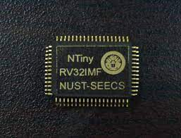

# Qazi Shahid Ullah

- **LinkedIn:** [shahid-ullah](https://www.linkedin.com/in/shahid-ullah-43baa1131/)
- **GitHub:** [qaziullah](https://github.com/qaziullah)

---

## Summary
With over 5 years of practical ASIC design expertise, I excel in capturing design specifications, converting them into architecture and micro-architecture, implementing the system in System-Verilog HDL, and executing physical design using industry-standard EDA tools. Notably, I have played a pivotal role in two successful TSMC 65nm tape-outs of RISC-V processors. Currently, I am actively engaged in the microarchitecture and physical design of a Match-Action processor at DreamBig Semiconductor.

---

## Experience

### Senior Hardware Design Engineer

**DreamBig Semiconductor Inc.**  
*Jan 2024 — Present*  
Islamabad, Pakistan  

### Hardware Design Engineer

**DreamBig Semiconductor Inc.**  
*Jan 2023 — Dec 2023*  
Islamabad, Pakistan  

### Research Assistant

**Integrated Circuit (IC) Design Lab (ICDL)**  
*Sep 2020 – Feb 2023*  
NUST-SEECS, Islamabad  

---

## Projects

### RISC-V Processor Design: NTiny [[link1](https://www.dawn.com/news/1694672), [link2](https://ics.seecs.edu.pk/research#h.bbd8fxi223bq)]

*Aug 2021 – Feb 2023*

- Played an integral role in the ground-up development and successful tape-out of a 1mmX1mm RISC-V based micro-
controller chip, [Nust-Tiny (NTiny)](https://ics.seecs.edu.pk/research#h.bbd8fxi223bq), on the TSMC 65nm node, with 50MHz operating frequency.
- Lead the design, implementation, and verification of its un-core system and peripheral IPs (UART, I2C, SPI).
- Worked on single precision floating-point unit (FPU) for in-house processor core.
- Emulation of NTiny softcore on Intel FPGA.
- Used chipalliance RISC-V DV framework and Cadence Incisive tool for verification and coverage of processor core.
- Developed eclipse based SDK for software development on NTiny(soft-core & ASIC) enabled both programming and debugging feature in Eclipse for NTiny

   
### SoC design on FPGA using NVDLA

*Nov 2020 – Aug 2021*

- Integrated an ARM core and Nvidia’s Deep Learning Accelerator (NVDLA) on Intel FPGA.
- Generated Embedded Linux system for the SoC using Yocto project.

---

## Skills

- **Tools:** Cadence, Synopsys, Questasim, Intel Quartus
- **Devices:** NTiny, Intel FPGA, ARM Dev-boards
- **Expertise:** RTL/Hardware Design, Physical Design, FPGA Prototyping

---

## Online Learning

- FPGA Design for Embedded Systems Specialization (Coursera, University of Colorado Boulder)
- Deep Learning Specialization (Coursera, deeplearning.ai)
- Computer Communications Specialization (Coursera, University of Colorado Boulder)
- Computer Architecture (Coursera, Princeton University)

---

## Interests

Running, Hiking/Trekking, Football, Badminton, Table Tennis
